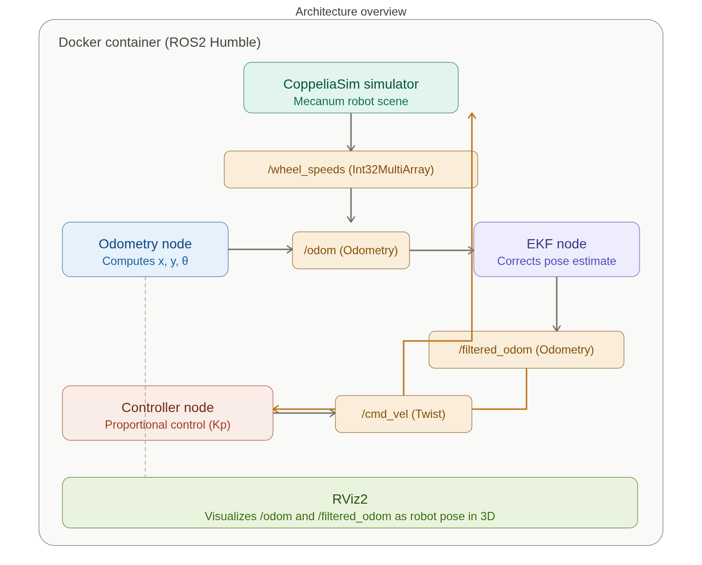

# Representación de Robot Omnidireccional

Dado a que es mi futuro trabajo de tesis, me restringo a subir ciertos archivos.

## Partes

1. CoppeliaSim — Visualización 3D, envía cantidad de ticks de las ruedas a ROS2.

2. Odometry node — estima pose a partir de la velocidad de las ruedas, computa la pose estimada, x, y, theeta usando la cinematica del papaer de Taheri.

3. EKF node —  Fusiona sensores e informacion para corregir la odometria estimada.

4. Controller node —  Toma una posicion objetivo y compa.

5. RViz2 — just visualizes everything in 3D, consuming the /odom and /filtered_odom topics.

Todo esto corre dentro del docker.

## Info del docker

robmovil_msgs no es un standrar ros2 package, el codigo no va a compilar isn el.

Compila un plugin puente entre coppeliaSim y ros2

Para que las cosas sean compialdas en el containes usamos la ruta /root/ros2_ws

## En fin .... 

Para levantar.

1. xhost +local:docker 
resetea tood reboot, cada vez que reinciio la compu lo corro.

2. docker start ros2_omni 

Levanto docker.

3. 3 trerminales, con

docker exec -it ros2_omni bash

c/u : 

1. bash /root/scripts/coppeliaSim.sh

2. ros2 run modelo_omnidireccional omni_odometry_node

3. 

En este paso se tiene que haber cargado unas flechas coloridas que son los frames del robot en rviz.

modelo_omnidireccional/
-CMakeLists.txt -> Le dice a colcon como compilar cada nodo.
-package.xml -> Declara dependencias
-src/
    -omni_odometry.h -> Declara la clase
    -omni_odometry.cpp -> class implementation
    -omni_odometry_node.cpp ->  main() - entrada
    
    -types.h -> estructura de datos compartida
    -trajectory_generator.h -> declaracion de clase
    -trajectoty_generator.cpp -> genera waypoints
    -trajectory_pilot.h -> declaracion de clase
    -trajectory_pilot.cpp -> logica del controlador
    -trajectory_pilote_node.cpp -> main() , entrada
